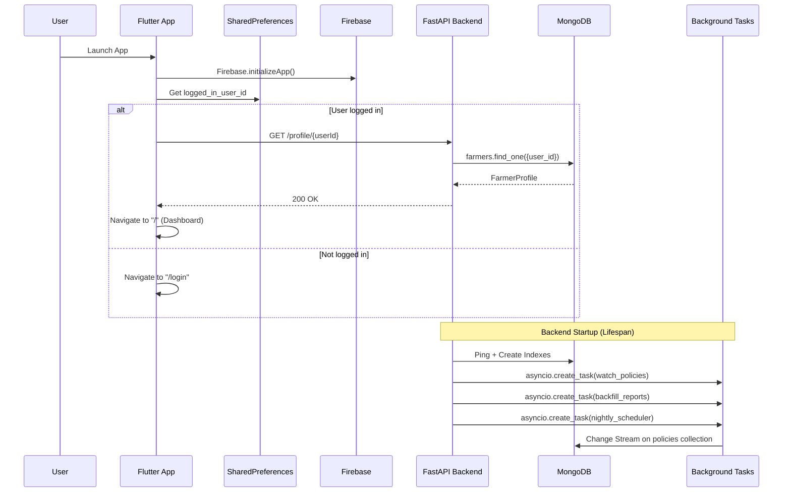
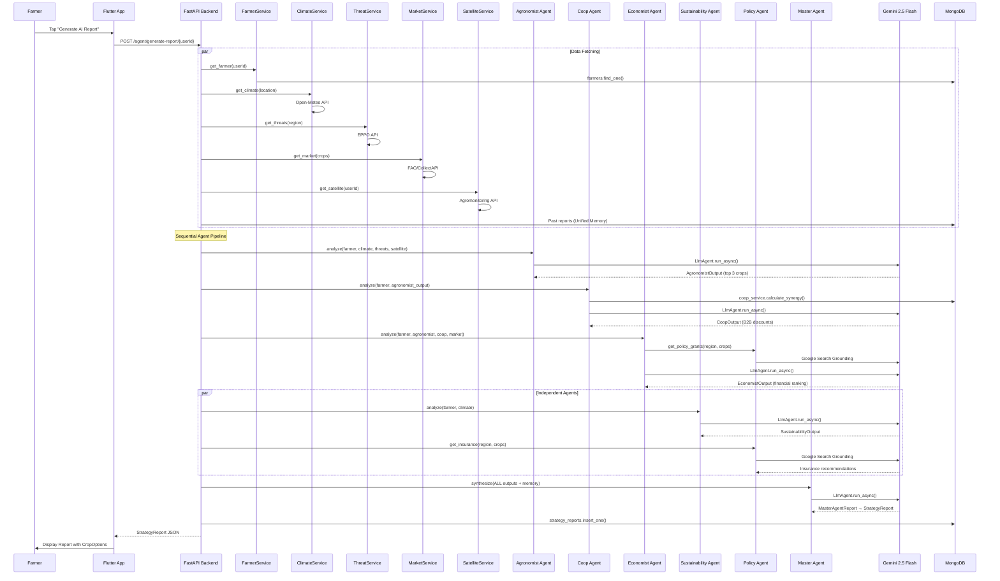
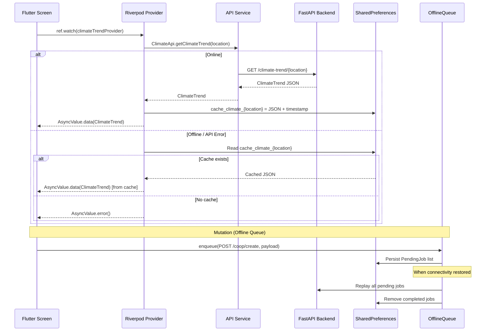
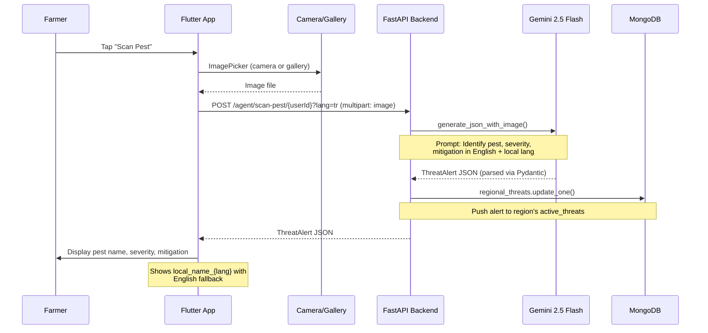
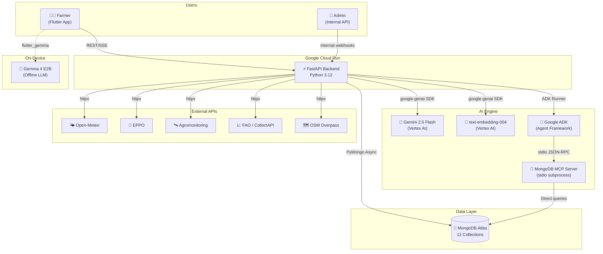
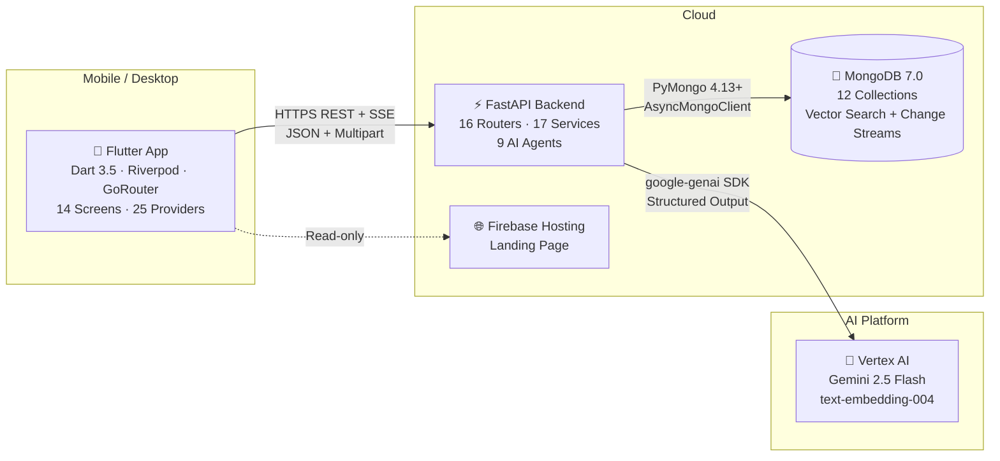
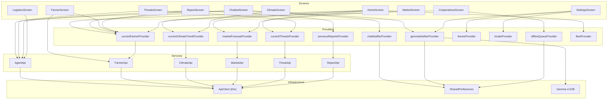
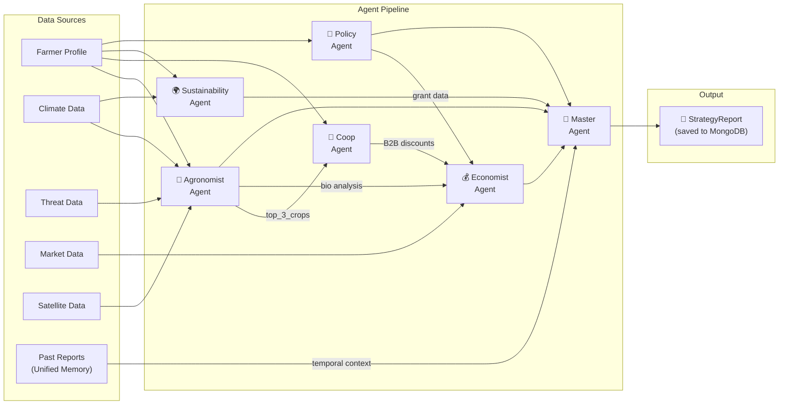

# 🏗️ AgriAgent — Complete Architecture Analysis

> **Reverse-engineered from source code** — Every dependency verified through imports, constructor injection, and runtime wiring.

---

## Table of Contents

1. [System Overview](#1-system-overview)
2. [C4 Context Diagram](#output-1-c4-context-diagram)
3. [C4 Container Diagram](#output-2-c4-container-diagram)
4. [Component Diagrams](#output-3-component-diagrams)
5. [Sequence Diagrams](#output-4-sequence-diagrams)
6. [Architecture Decision Summary](#output-5-architecture-decision-summary)
7. [Mermaid Diagrams](#output-6-mermaid-diagrams)

---

## 1. System Overview

AgriAgent is a **Multi-Agent System (MAS)** for smallholder farmers, built for the **Google Cloud Rapid Agent Hackathon**. It combines predictive climate models, real-time pest intelligence, futures market forecasting, and cooperative logistics into a single AI-powered advisory platform.

| Dimension | Detail |
|-----------|--------|
| **Architectural Style** | Layered Service Architecture + Multi-Agent AI Pipeline |
| **Backend** | FastAPI 0.115+ · Python 3.12+ · PyMongo 4.13+ (AsyncMongoClient) |
| **Frontend** | Flutter 3.24+ · Dart 3.5+ · Riverpod · GoRouter |
| **Database** | MongoDB 7.0 (Atlas) |
| **AI Engine** | Google Gemini 2.5 Flash (Vertex AI) + Google ADK |
| **On-Device AI** | Gemma 4 E2B (LiteRT via flutter_gemma) |
| **Hosting** | Google Cloud Run (Backend) · Firebase Hosting (Landing Page) |
| **Total Endpoints** | ~45 across 16 routers |
| **Total Screens** | 14 Flutter screens |
| **Languages** | 11 (en, tr, nl, es, it, ja, ko, fr, pt, hi, zh) |

---

# Output 1: C4 Context Diagram

## Users

| User | Description |
|------|-------------|
| **Smallholder Farmer** | Primary user — views dashboard, scans pests, reads AI reports, chats with AI assistant |
| **Cooperative Admin** | Creates/manages cooperatives, shares machinery |
| **System Admin** | Triggers internal webhooks (Scout Agent, Backfill) via `/internal/` endpoints |

## External Systems

| System | Type | Purpose |
|--------|------|---------|
| **Google Gemini 2.5 Flash** | LLM API (Vertex AI) | All AI generation — reports, chat, pest scanning, triage, logistics advice |
| **Google text-embedding-004** | Embedding API (Vertex AI) | Vector embeddings for RAG (policy documents) |
| **MongoDB Atlas** | Database | Primary persistence — 12 collections |
| **Open-Meteo** | Weather API (Free) | Historical climate, forecasts, soil moisture, ET₀, chilling hours, GDD |
| **EPPO Data Service** | Pest API | Pest/disease identification and regional threat data |
| **Agromonitoring** | Satellite API | NDVI, soil moisture, field polygon management |
| **FAO / CollectAPI / API Ninjas** | Market APIs | Commodity price data (multi-source with fallback) |
| **OSM Overpass** | Geospatial API | Nearby cooperative discovery |
| **Firebase Cloud Messaging** | Push Notifications | Farmer alerts |
| **MongoDB MCP Server** | MCP Tool | Gives AI chat agent direct DB query capability |

## Main Application

| Component | Technology | Deployment |
|-----------|------------|------------|
| **Flutter Mobile App** | Flutter 3.24 + Riverpod | iOS / Android / macOS / Windows |
| **FastAPI Backend** | Python 3.12 + FastAPI | Google Cloud Run |
| **Landing Page** | Vanilla HTML/CSS/JS | Firebase Hosting |

## Relationships

```
Farmer ──── uses ────► Flutter App
Flutter App ──── REST/SSE ────► FastAPI Backend
FastAPI Backend ──── queries ────► MongoDB Atlas
FastAPI Backend ──── calls ────► Gemini 2.5 Flash (Vertex AI)
FastAPI Backend ──── fetches ────► Open-Meteo, EPPO, Agromonitoring, FAO
FastAPI Backend ──── spawns ────► MongoDB MCP Server (stdio subprocess)
Flutter App ──── offline inference ────► Gemma 4 E2B (on-device)
Flutter App ──── push notifications ────► Firebase Cloud Messaging
```

---

# Output 2: C4 Container Diagram

## Containers

| Container | Technology | Responsibility |
|-----------|------------|----------------|
| **Flutter App** | Dart 3.5, Flutter 3.24, Riverpod, GoRouter | Cross-platform UI, offline-first caching, on-device AI fallback |
| **FastAPI Backend** | Python 3.12, FastAPI, Pydantic v2 | REST API, AI agent orchestration, external API aggregation |
| **MongoDB** | MongoDB 7.0 (Atlas) | Document storage, vector search, change streams, time series |
| **AI Agent Pipeline** | Google ADK, Gemini 2.5 Flash | Multi-agent report generation, conversational chat |
| **MCP Server** | `@mongodb-js/mongodb-mcp-server` (Node.js) | Gives chat agent direct database query tools |
| **Nightly Scheduler** | asyncio background task | Scout Agent ETL + Report backfill at 03:00 daily |


## Communication Paths

| From | To | Protocol | Format |
|------|----|----------|--------|
| Flutter App | FastAPI Backend | HTTPS | REST JSON + SSE streams + Multipart uploads |
| FastAPI Backend | MongoDB | TCP | PyMongo AsyncMongoClient |
| FastAPI Backend | Gemini | HTTPS | google-genai SDK (Vertex AI) |
| FastAPI Backend | Open-Meteo | HTTPS | REST JSON |
| FastAPI Backend | EPPO | HTTPS | REST JSON |
| FastAPI Backend | Agromonitoring | HTTPS | REST JSON |
| FastAPI Backend | MCP Server | stdio | JSON-RPC (Model Context Protocol) |
| Flutter App | Gemma 4 E2B | In-process | flutter_gemma (LiteRT) |
| Flutter App | FCM | HTTPS | Firebase Messaging SDK |

---

# Output 3: Component Diagrams

## 3.1 Backend Components

### Router Layer (16 routers, ~45 endpoints)

| Router | File | Endpoints | Dependencies |
|--------|------|-----------|--------------|
| `agent` | [agent.py](file:///Users/nezihes/Desktop/agrticulture%20agent/backend/app/routers/agent.py) | 7 | agent_service, llm_utils |
| `profile` | [profile.py](file:///Users/nezihes/Desktop/agrticulture%20agent/backend/app/routers/profile.py) | 7 | farmer_service, soil_service |
| `climate` | [climate.py](file:///Users/nezihes/Desktop/agrticulture%20agent/backend/app/routers/climate.py) | 2 | climate_service |
| `market` | [market.py](file:///Users/nezihes/Desktop/agrticulture%20agent/backend/app/routers/market.py) | 1 | market_service |
| `threats` | [threats.py](file:///Users/nezihes/Desktop/agrticulture%20agent/backend/app/routers/threats.py) | 1 | threat_service |
| `satellite` | [satellite.py](file:///Users/nezihes/Desktop/agrticulture%20agent/backend/app/routers/satellite.py) | 4 | satellite_service |
| `reports` | [reports.py](file:///Users/nezihes/Desktop/agrticulture%20agent/backend/app/routers/reports.py) | 2 | report_service |
| `fleet` | [fleet.py](file:///Users/nezihes/Desktop/agrticulture%20agent/backend/app/routers/fleet.py) | 3 | fleet_service |
| `cooperative` | [cooperative.py](file:///Users/nezihes/Desktop/agrticulture%20agent/backend/app/routers/cooperative.py) | 10 | cooperative_service, OSM Overpass |
| `chilling` | [chilling.py](file:///Users/nezihes/Desktop/agrticulture%20agent/backend/app/routers/chilling.py) | 1 | chilling_service |
| `gdd` | [gdd.py](file:///Users/nezihes/Desktop/agrticulture%20agent/backend/app/routers/gdd.py) | 1 | gdd_service |
| `slope` | [slope.py](file:///Users/nezihes/Desktop/agrticulture%20agent/backend/app/routers/slope.py) | 1 | slope_service |
| `triage` | [triage.py](file:///Users/nezihes/Desktop/agrticulture%20agent/backend/app/routers/triage.py) | 1 | triage_agent |
| `irrigation` | [irrigation.py](file:///Users/nezihes/Desktop/agrticulture%20agent/backend/app/routers/irrigation.py) | 1 | irrigation_service |
| `sensor` | [sensor.py](file:///Users/nezihes/Desktop/agrticulture%20agent/backend/app/routers/sensor.py) | 4 | llm_utils (Gemini Vision) |
| `internal` | [internal.py](file:///Users/nezihes/Desktop/agrticulture%20agent/backend/app/routers/internal.py) | 3 | scout_agent, backfill_reports |

### Service Layer (17 services)

| Service | Responsibility | External Deps | Depended-on-by |
|---------|---------------|---------------|----------------|
| **agent_service** | AI orchestration brain | All agents, all services, ADK, MCP | agent router |
| **farmer_service** | Farmer CRUD | MongoDB | profile router, agent_service |
| **climate_service** | Climate data fetch + cache | Open-Meteo, Geocoding, MongoDB | climate router, agent_service |
| **threat_service** | Pest/disease intelligence | EPPO, GBIF, Gemini, MongoDB | threats router, agent_service |
| **market_service** | Price aggregation | FAO, CollectAPI, API Ninjas, MongoDB | market router, agent_service |
| **satellite_service** | Satellite imagery analysis | Agromonitoring, MongoDB | satellite router, agent_service |
| **report_service** | Report CRUD | MongoDB | reports router, agent_service |
| **cooperative_service** | Coop membership + machines | MongoDB | cooperative router |
| **fleet_service** | Machine scheduling | Open-Meteo, Geocoding, MongoDB | fleet router |
| **irrigation_service** | Irrigation assessment | Open-Meteo, Geocoding | irrigation router |
| **chilling_service** | Chilling hours | Open-Meteo, Geocoding | chilling router |
| **gdd_service** | Growing degree days | Open-Meteo, Geocoding | gdd router |
| **slope_service** | Slope/erosion analysis | Open-Meteo Elevation | slope router |
| **soil_service** | Soil report OCR | Gemini Vision | profile router |
| **coop_service** | B2B synergy calculation | MongoDB aggregation | coop_agent |
| **mongo_session** | ADK chat persistence | MongoDB | agent_service |

### Agent Layer (9 agents)

| Agent | Type | Model | Input | Output |
|-------|------|-------|-------|--------|
| **Agronomist** | ADK LlmAgent | gemini-2.5-flash | farmer, climate, threats, satellite | `AgronomistOutput` |
| **Coop** | ADK LlmAgent | gemini-2.5-flash | farmer, agronomist output, DB synergy | `CoopOutput` |
| **Economist** | ADK LlmAgent | gemini-2.5-flash | farmer, agronomist, coop, market | `EconomistOutput` |
| **Sustainability** | ADK LlmAgent | gemini-2.5-flash | farmer, climate | `SustainabilityOutput` |
| **Master** | ADK LlmAgent | gemini-2.5-flash | ALL agent outputs + memory | `MasterAgentReport` → `StrategyReport` |
| **Policy** | Direct genai.Client | gemini-2.5-flash + text-embedding-004 | region, crops | Grants/insurance strings |
| **Scout** | Direct genai.Client | text-embedding-004 | Web scraping results | MongoDB policy documents |
| **Triage** | Direct genai.Client | gemini-2.5-flash | Weather + activities | Priority JSON |
| **Chat (Root)** | ADK LlmAgent | gemini-2.5-flash | User message + MCP + GoogleSearch | Free-text reply |

### External API Clients (7 clients)

| Client | File | APIs Called |
|--------|------|------------|
| **open_meteo** | `open_meteo.py` | `api.open-meteo.com`, `archive-api.open-meteo.com` |
| **geocoding** | `geocoding.py` | `geocoding-api.open-meteo.com` + 25-city static lookup |
| **elevation** | `elevation.py` | `api.open-meteo.com/v1/elevation` |
| **eppo_client** | `eppo_client.py` | `data.eppo.int` + hardcoded pest knowledge base |
| **gbif_client** | `gbif_client.py` | GBIF occurrence API |
| **agromonitoring** | `agromonitoring.py` | `api.agromonitoring.com` |
| **market_data** | `market_data.py` | FAO, CollectAPI, API Ninjas + hardcoded fallback |

---

## 3.2 Frontend Components

### Layer Architecture

```
┌─────────────────────────────────────────────────────────┐
│                    SCREENS (14)                          │
│  HomeScreen · ChatbotScreen · FarmerScreen · Climate     │
│  Threats · Market · Report · Cooperatives · Logistics    │
│  Settings · Login · Onboarding · ProfileEdit · Offline   │
├─────────────────────────────────────────────────────────┤
│                    WIDGETS (15)                          │
│  ResponsiveScaffold · GlassCard · StatTile · ThreatBadge │
│  TrendChart · PriceRow · RiskGauge · CropTimeline        │
│  DailyBriefingCard · FleetCalendarCard · UrgencyRadar    │
│  ShimmerLoading · DeveloperConsole · EditPlotDialog       │
│  LocationSearchDialog                                    │
├─────────────────────────────────────────────────────────┤
│                  PROVIDERS (25)                          │
│  State Management via Riverpod (auto-dispose + keepAlive)│
│  FutureProviders for async data · Notifiers for state    │
├─────────────────────────────────────────────────────────┤
│                   SERVICES (8)                          │
│  ApiClient (Dio) · AgentApi · FarmerApi · ClimateApi     │
│  MarketApi · ThreatApi · ReportApi · PushNotification    │
├─────────────────────────────────────────────────────────┤
│                    MODELS (8)                           │
│  FarmerProfile · ClimateTrend · RegionalThreats          │
│  MarketForecast · StrategyReport · Cooperative           │
│  FleetSchedule · PlotDraft                               │
├─────────────────────────────────────────────────────────┤
│                 INFRASTRUCTURE                          │
│  GoRouter · AgriAgentTheme (M3) · L10n (11 langs)        │
│  Responsive breakpoints · SharedPreferences cache        │
│  OfflineQueue · Gemma 4 E2B · Firebase Messaging         │
└─────────────────────────────────────────────────────────┘
```

---

# Output 4: Sequence Diagrams

## 4.1 Application Startup



## 4.2 Main User Workflow — AI Strategy Report Generation



## 4.3 Data Persistence Workflow — Offline-First Caching



## 4.4 API Request Workflow — Pest Scanning (Multimodal)



---

# Output 5: Architecture Decision Summary

## Architectural Style

| Aspect | Classification |
|--------|---------------|
| **Overall** | **Layered Service Architecture** with Multi-Agent AI Pipeline |
| **Backend** | Router → Service → Repository (MongoDB direct) → External APIs |
| **Frontend** | **MVVM** via Riverpod (Model → Provider/Notifier → ConsumerWidget) |
| **AI System** | **Sequential Multi-Agent Pipeline** (report) + **Hierarchical Sub-Agent** (chat) |
| **Data Strategy** | **Offline-First** with cache-then-network + offline mutation queue |

## Design Patterns Catalog

| Pattern | Where | Implementation |
|---------|-------|----------------|
| **Dependency Injection** | Backend | FastAPI `Depends(get_db)` for database access |
| **Dependency Injection** | Frontend | Riverpod `ref.read()` / `ref.watch()` |
| **Service Layer** | Backend | Thin routers delegate to service modules |
| **Repository** | Backend | Services query MongoDB directly (no ORM) |
| **MVVM** | Frontend | Models ↔ Providers (ViewModel) ↔ Screens (View) |
| **Cache-First + Graceful Degradation** | Both | Try API → cache on success → fallback to cache on failure |
| **Offline Queue** | Frontend | `OfflineQueueProvider` stores pending mutations in SharedPreferences |
| **Multi-Agent System (MAS)** | Backend | 5 ADK LlmAgents in sequential pipeline with typed Pydantic outputs |
| **RAG (Retrieval-Augmented Generation)** | Backend | MongoDB `$vectorSearch` + `text-embedding-004` for policy lookup |
| **ETL Pipeline** | Backend | Scout Agent scrapes gov sites → embeds → loads into MongoDB nightly |
| **Change Streams** | Backend | Real-time MongoDB watcher for policy insert → push notification trigger |
| **MCP (Model Context Protocol)** | Backend | `@mongodb-js/mongodb-mcp-server` gives chat agent DB query tools |
| **Structured Output** | Backend | Gemini `response_mime_type="application/json"` + `response_schema` |
| **Observer Pattern** | Frontend | Riverpod reactive providers + Connectivity stream listeners |
| **Strategy Pattern** | Backend | Multi-source market data with fallback chain (FAO → CollectAPI → API Ninjas → hardcoded) |
| **Adapter Pattern** | Frontend | `ApiClient` wraps Dio with generic `get<T>()` / `post<T>()` + parser callbacks |
| **Shell Pattern** | Frontend | GoRouter `ShellRoute` wraps screens with `ResponsiveScaffold` |
| **State Machine** | Frontend | Gemma download states: `notDownloaded → downloading → ready → error` |

## Potential Architectural Weaknesses

> [!WARNING]
> ### 1. Authentication Gap
> No JWT/OAuth/session tokens. User identity is passed as `user_id` path parameter. Login is a simple email lookup. Acceptable for hackathon, but not production-ready.

> [!WARNING]
> ### 2. Sequential Pipeline Bottleneck
> Sustainability and Insurance agents are independent of the Economist agent but run sequentially. Could be parallelized with `asyncio.gather()` to reduce report generation time by ~30%.

> [!WARNING]
> ### 3. Hardcoded Session IDs
> Pipeline agents use fixed session IDs like `"agronomist_session"`. Under concurrent requests, these could collide and produce corrupted results.

> [!CAUTION]
> ### 4. Auth Method Inconsistency
> `calculate_urgency_radar()` uses `api_key` auth while all other Gemini calls use Vertex AI. This is likely an oversight that could cause failures if the API key is not set.

> [!NOTE]
> ### 5. ADK output_schema Underutilized
> All ADK agents set `output_schema` but then manually strip markdown fences and call `json.loads()`. The native ADK auto-parsing is bypassed, adding fragility.

> [!NOTE]
> ### 6. Triage Agent Appears Unused in Pipeline
> `triage_agent.py` is defined and has a router, but it is never called from `agent_service.generate_full_report()`. It only runs via the `/triage/{user_id}` endpoint.

---

# Output 6: Mermaid Diagrams

## 6.1 System Architecture Overview



## 6.2 Container Diagram



## 6.3 Backend Component Diagram

```mermaid
graph TB
    subgraph "Router Layer"
        R1["agent"]
        R2["profile"]
        R3["climate"]
        R4["market"]
        R5["threats"]
        R6["satellite"]
        R7["reports"]
        R8["fleet"]
        R9["cooperative"]
        R10["sensor"]
        R11["chilling/gdd/slope"]
        R12["irrigation"]
        R13["triage"]
        R14["internal"]
    end

    subgraph "Service Layer"
        S1["agent_service<br/>(THE BRAIN)"]
        S2["farmer_service"]
        S3["climate_service"]
        S4["market_service"]
        S5["threat_service"]
        S6["satellite_service"]
        S7["report_service"]
        S8["cooperative_service"]
        S9["fleet_service"]
        S10["irrigation_service"]
        S11["coop_service"]
        S12["mongo_session"]
    end

    subgraph "Agent Layer"
        A1["🌱 Agronomist"]
        A2["🤝 Coop"]
        A3["💰 Economist"]
        A4["🌍 Sustainability"]
        A5["📜 Policy"]
        A6["👑 Master"]
        A7["🔍 Scout (Nightly)"]
        A8["⚠️ Triage"]
    end

    subgraph "External API Clients"
        E1["open_meteo"]
        E2["eppo_client"]
        E3["agromonitoring"]
        E4["market_data"]
        E5["geocoding"]
        E6["elevation"]
    end

    R1 --> S1
    R2 --> S2
    R3 --> S3
    R4 --> S4
    R5 --> S5
    R6 --> S6
    R7 --> S7
    R8 --> S9
    R9 --> S8
    R13 --> A8

    S1 --> A1 & A2 & A3 & A4 & A5 & A6
    S1 --> S2 & S3 & S4 & S5 & S6 & S7 & S11 & S12

    A2 --> S11
    A3 --> A5

    S3 --> E1 & E5
    S5 --> E2
    S6 --> E3
    S4 --> E4
    S9 --> E1 & E5
```



## 6.4 Frontend Dependency Graph



## 6.5 AI Agent Pipeline Dependency Graph



---

## Database Schema Map

| Collection | Key Fields | Indexes | Access Pattern |
|------------|------------|---------|----------------|
| `farmers` | user_id, name, location, region, plots[], crops[] | user_id (unique), region, location_geo (2dsphere) | Read-heavy, profile CRUD |
| `climate_trends` | location, region, historical[], forecast | location (unique), region | Cache-first, TTL refresh |
| `regional_threats` | region, active_threats[], overall_risk_level | region, active_threats.reported_date | Cache-first, push on scan |
| `market_data` | crop, current_price, predicted_price, trend | crop (unique) | Nightly refresh |
| `strategy_reports` | user_id, season, recommendations[], created_at | (user_id, created_at) compound | Append-only, read for memory |
| `field_polygons` | user_id, agro_polygon_id, coordinates | user_id, agro_polygon_id (sparse) | Satellite integration |
| `cooperatives` | coop_id, name, region, member_ids[], machines[] | coop_id (unique), join_code (unique), location_geo (2dsphere) | CRUD + geospatial queries |
| `fleet_bookings` | machine_id, date, assignee, status | (machine_id, date) compound unique | 5-day rolling window |
| `sensor_data` | plot_id, timestamp, temperature, humidity, soil_moisture | Time Series (timestamp, plot_id meta) | IoT ingestion + trends |
| `policies` | title, text, embedding[], source, date | Vector index on embedding | RAG via $vectorSearch |
| `adk_sessions` | app_name, user_id, id, events[] | (app_name, user_id, id) | Chat persistence |

---

